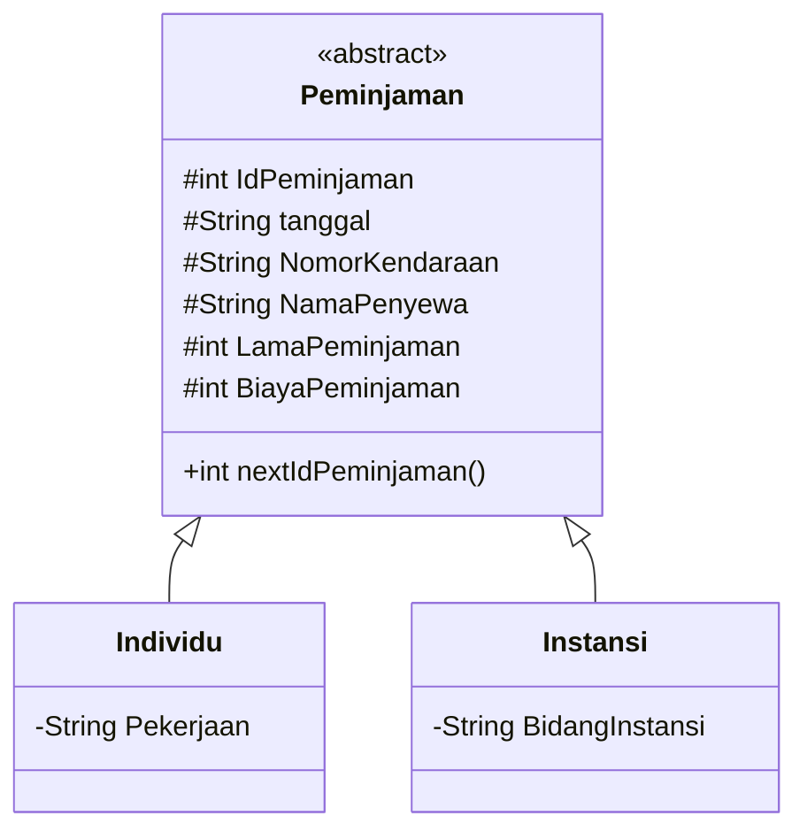
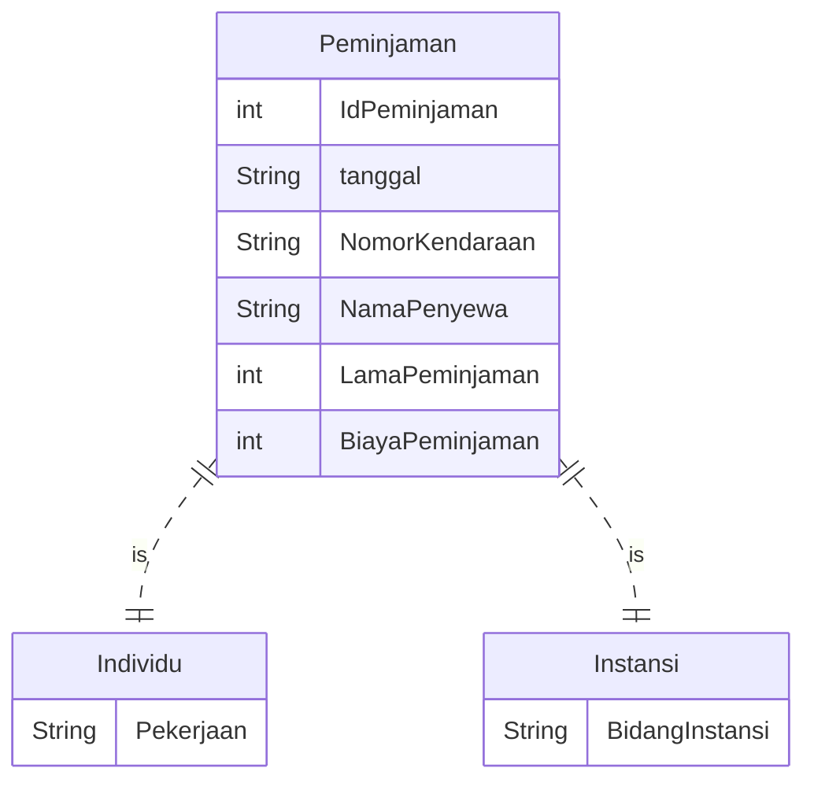
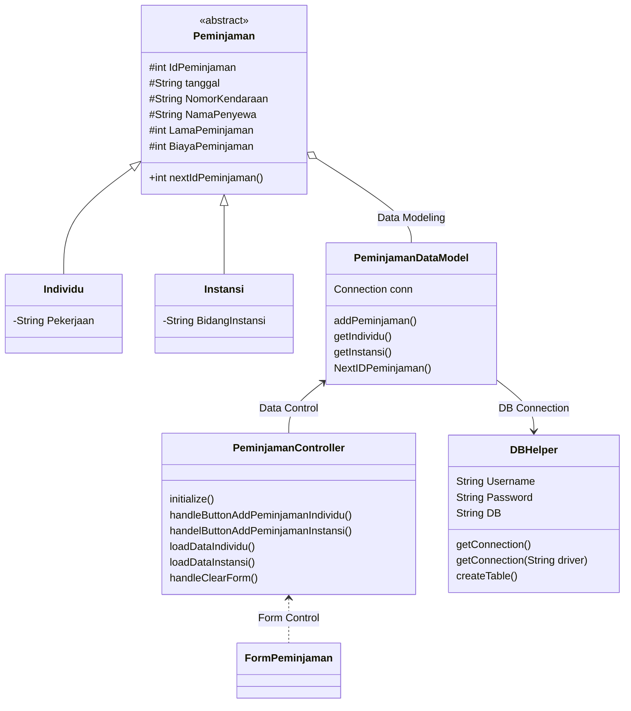

# Nama Anggota Kelompok
1. 1917051001/Imam Akbar
2. 1917051002/Dota Ningtias
3. 1917051003/Anisa Nadila Lase

# 🚌 Peminjaman Mobil Bus
> Sistem dapat digunakan untuk melakukan peminjaman mobil bus, dimana mobil dapat dipinjam oleh individual atau instansi.
> Dalam satu kali transaksi hanya dapat meminjam satu mobil.

📚 Libraries and Tools of this project:
- mysql-connector-java-5.1.xx.jar
- sqlite-jdbc-3.xx.jar
- scene builder
- sqlite studio
- mysql server (xampp recomended)
- netbean editor
- VS Code installed plugin
    - Markdown All in one
    - Markdown preview
    - Live Server

## 🖌️ Desain
To view the diagrams below install mermaid-diagram plugin at https://github.com/Redisrupt/mermaid-diagrams

### Class Diagram

### ER Diagram

### Design Class Diagram for JavaFX and Database

